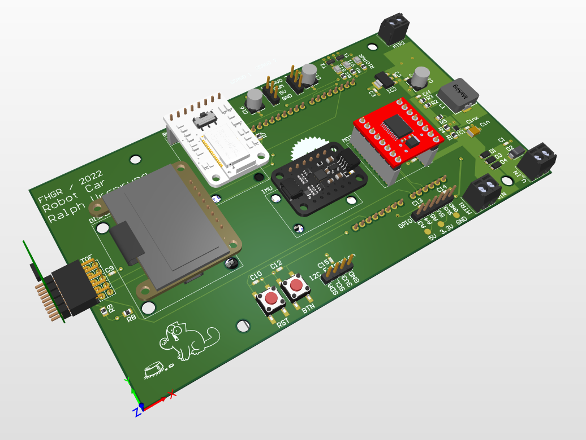
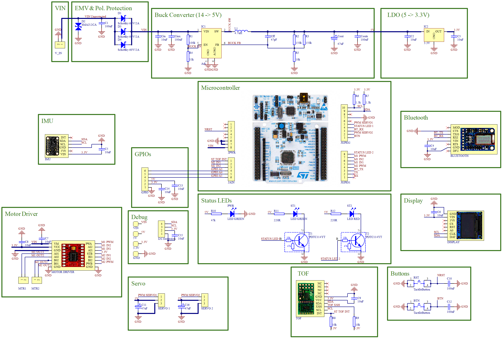

# Electronics
The robotcar is using a custom-designed PCB for power regulation, power distribution and general connectivity.
On this, various external components are mounted.

Power is supplied by 8x AA batteries placed in a battery holder. The battery connection is done using an XC30 connector,
to make it easier to remove the battery holder.
A physical on/off switch is included in the power line from the XC30 connector to the PCB.
This switch is not on the PCB itself because the design of the base car already included one and using that safes space on the PCB.

## Schematic & PCB Design
The PCB contains the following components:
* Power regulation
    * 12V DC power input
        * Including EMV & polarity protection
    * 12V -> 5V power regulation using a [buck converter](https://en.wikipedia.org/wiki/Buck_converter)
    * 5V -> 3.3V power regulation using an [LDO regulator](https://en.wikipedia.org/wiki/Low-dropout_regulator)
* Microcontroller board connector (Arduino V3 connector)
* Add-ons / 3rd party modules
    * Motor Driver ([SparkFun Motor Driver - Dual TB6612FNG](https://www.sparkfun.com/products/14450))
    * Distance Sensor (TOF, [ST VL53L1X](https://www.st.com/en/imaging-and-photonics-solutions/vl53l1x.html))
    * Bluetooth ([Adafruit Bluefruit LE UART Friend](https://learn.adafruit.com/introducing-the-adafruit-bluefruit-le-uart-friend))
    * IMU ([Adafruit MPU6050](https://learn.adafruit.com/mpu6050-6-dof-accelerometer-and-gyro))
    * User button
    * Reset button (triggers a reset of the microcontroller)
* Connectors / debug connectors
    * I2C connector
    * 3 GPIO pins
    * 2 connectors for servo motors
    * Power measurement pads for VIN, 5V, 3.3V and GND

See the schematic for the details of the individual components mounted on the PCB.

Note: at the moment, the PCB schematic & layout are not published in the repository, as they rely on a FHGR-specific component library.

### Power Regulation
The board is designed to be run with ca. 12V as input (8x AA batteries) and a maximum of 5A (= ca. 25W) at the input.

The board provides VIN to the motor(s) and the microcontroller board (which has its own voltage regulators),
5V to the servo(s) and 3.3V to the other components.

The layout of the buck converter and LTO has been taken from the respective datasheet (which provide best practices for the layouts).

