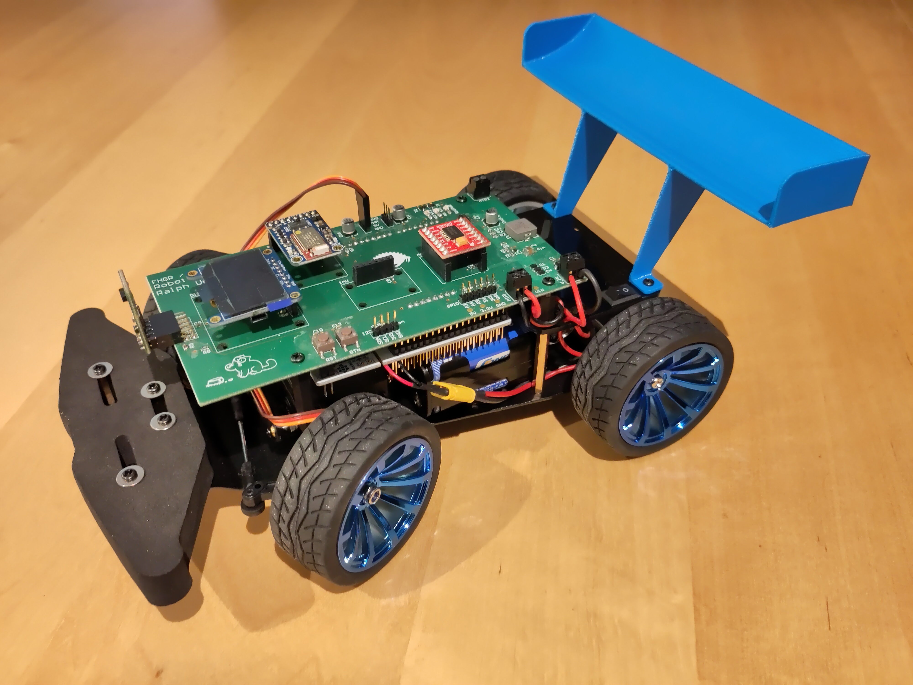

# Introduction
This is the documentation for the toy RC robot car developed by me as part of the first mobile robotics project
(a 3rd semester module) of the [BSc in Mobile Robotics at FHGR](https://fhgr.ch/mr).

Note that this was implemented in a (somewhat) time-boxed manner, accordingly not everything is implemented or working as it should.

## Code Artefacts Created
As part of this project several code artefacts have been created:
* the [robotcar1](https://github.com/rursprung/robotcar1/) application:
  this is the main application running on the microcontroller and is specific to this module
* two new embedded Rust crates:
  * [tb6612fng](https://crates.io/crates/tb6612fng): a driver for the motor controller of the same name
  * [adafruit-bluefruit-protocol](https://crates.io/crates/adafruit-bluefruit-protocol): protocol parsing of the Adafruit Bluefruit Protocol
* minor contributions (code, issues, reviews, etc.) to various projects (not explicitly listed here, feel free to check
  [my activity stream on GitHub](https://github.com/rursprung/) for the duration between September 2022 and January 2023 -
  it should be obvious which ones were related to this project).

## Available Documentation
This documentation is in addition to the in-code documentation, not a replacement thereof. For implementation details
and refer to the source code and its inline documentation.

This documentation has been created using [mdBook](https://rust-lang.github.io/mdBook/).
It is published [online](https://rursprung.github.io/robotcar1/) on every push to the master branch.
To view a live version of it run `mdbook serve` in the `docs/` folder.

To view the source code documentation in an interactive web based way run `cargo doc --open` in the root folder.
Note that for this to work you must have installed the necessary dependencies as outlined in the README there.
